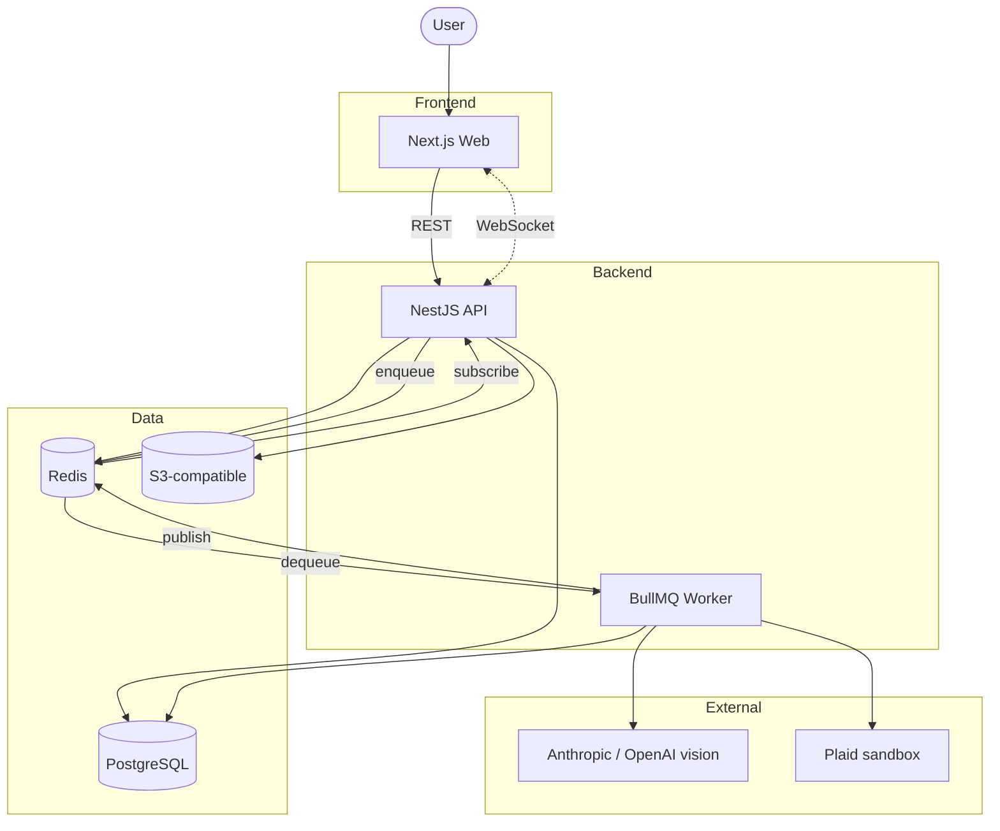

# Architecture

A high-level look at how Vellum is put together. See [`docs/adr/`](./adr/) for the reasoning behind specific decisions.

## Components

## What each piece does

### Web (Next.js)

The user-facing app. Server Components for read paths, Server Actions for simple writes, client components only where interactivity demands it. Long-running operations (extraction, bank import) go through the API rather than Server Actions, so they can be queued and retried.

### API (NestJS)

The authoritative source of truth. All writes pass through here, all domain invariants are enforced here, all background work originates here. REST for write paths, a WebSocket gateway for live updates back to the web.

### PostgreSQL

The single source of durable state. Domain invariants like double-entry balance are enforced as CHECK constraints at the database level, not in application code. Drizzle is the ORM; migrations are SQL-first.

### Redis

Two roles. First, the BullMQ queue for background work like AI extraction and bank syncing. Second, the pub/sub bus that fans WebSocket events out from API replicas to the right web sessions when the system scales beyond a single API process.

### AI providers

Anthropic (Claude Sonnet vision) is primary; OpenAI (GPT-4o vision) is the fallback. Calls are typed via Zod schemas and never block a request handler. Extractions are enqueued, results are pushed back over WebSocket when ready.

### Plaid

Sandbox mode only for now. Source of imported bank transactions that the AI categorizes against the existing ledger.

## Request flow: receipt extraction

1. User uploads a receipt through Web
2. Web posts file metadata to API; the file itself goes to S3-compatible storage
3. API records a `pending` extraction row and enqueues a BullMQ job
4. A Worker picks up the job, calls the primary AI provider with the typed prompt; on failure it retries against the fallback provider
5. Worker writes the structured result to PostgreSQL and publishes an `extraction.ready` event to Redis
6. API WebSocket gateway forwards the event to the user's web session
7. Web renders the review-queue card; user confirms or edits the extraction
8. Confirmation triggers the ledger write, with an audit-log row recording which model and prompt version produced the data and what the user changed

## Trade-offs

- **NestJS + Next.js instead of a single-stack Next.js app.** Backend invariants (double-entry, idempotency, audit) live in a decorator-friendly framework that scales with domain complexity. Cost: more moving parts than a single Next.js app.
- **AI calls always async, never sync inside a request handler.** Adds queue and WebSocket complexity but prevents handler timeouts and makes retries trivial.
- **Postgres CHECK constraints over application-level validation.** Slower iteration on the ledger schema; safer because the database refuses to store an invalid entry. The double-entry invariant is the kind of bug that should be impossible, not the kind we test for.

See [`docs/adr/`](./adr/) for the decisions behind these and others.
